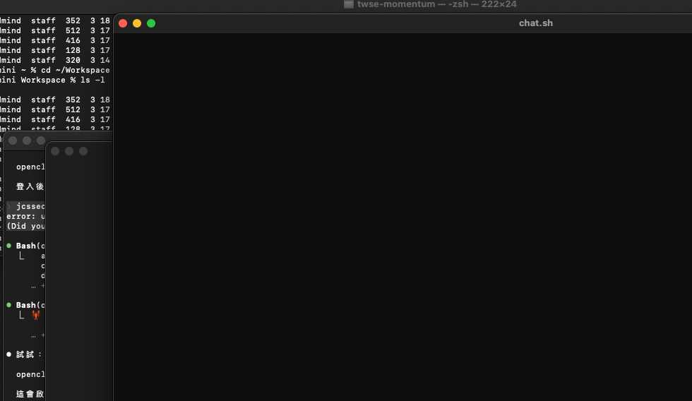

<table><tr><td></td><td><h1>chat.sh</h1></td></tr></table>

A terminal-native desktop app for managing AI coding assistants — Claude Code, OpenAI Codex, Gemini CLI, and more — in a single window.

Built with Tauri v2 + React + xterm.js. ~4MB, no Electron.



---

## Download

**macOS Apple Silicon**
```
brew tap jchang6513/chatsh
brew install --cask chatsh
```
Or [download the DMG](https://github.com/jchang6513/chatsh/releases/latest) directly.

> **First launch on macOS:** If you see "app is damaged", run this in Terminal:
> ```
> xattr -cr /Applications/chat.sh.app
> ```

---

## Features

### Session Persistence
- Panes survive app restart via a background daemon
- Shell tabs also persist — reopen the app and pick up where you left off
- Pane order is preserved across restarts

### Multi-Pane Management
- Open multiple Panes in one window (Claude Code, Codex, Gemini, Zsh, Python, Node...)
- Sidebar with live status indicators (RUNNING / STOPPED)
- Right-click Pane for Edit / Duplicate / Restart / Delete

### Templates
- Built-in templates for Claude, Gemini, Codex, Zsh
- Save custom templates (command + working dir + system prompt)

### System Prompts
- Per-Pane system prompts, completely isolated
- Supports `CLAUDE.md`, `GEMINI.md`, `AGENTS.md`

### Shell Tabs
- Add multiple shell tabs per Pane (`⌘T`)
- Rename (double-click), close, auto-scroll to active tab

### Status Bar
- Working dir, CLI name, color scheme, RUNNING/STOPPED
- Live clock · Battery level

### System Notifications
- macOS banner + sound when a background Pane finishes
- Toggle in Preferences

### Keyboard Shortcuts
| Shortcut | Action |
|---|---|
| `⌘1`–`⌘9` | Switch to Pane |
| `⌘Shift+[` / `⌘Shift+]` | Previous / Next Pane |
| `⌘K` | Command Palette |
| `⌘N` | New Pane |
| `⌘R` | Restart Pane |
| `⌘T` | New shell tab |
| `⌘W` | Close shell tab |
| `⌘[` / `⌘]` | Previous / Next shell tab |
| `⌘,` | Preferences |
| `⌘=` / `⌘-` | Zoom in / out |
| `Esc` | Close overlay |

### Preferences
- Font family, size, line height, cursor style
- 11 color schemes (Nightfox default)
- UI Scale (0.5x–2.0x), Sidebar position (left/right)
- Notifications toggle
- Template management

---

## Development

```bash
git clone https://github.com/jchang6513/chatsh
cd chatsh
npm install
npm run tauri dev
```

Requirements: [Rust](https://rustup.rs), [Node.js](https://nodejs.org)

### Testing
```bash
# Daemon integration tests (TC-D01~D07)
bash scripts/test-daemon.sh

# Type check
npx tsc --noEmit
```

See [`docs/test-cases.md`](docs/test-cases.md) for the full test case list.

---

## License

MIT

---

## Changelog

### v0.1.8
- **Security**: daemon socket restricted to owner only (0600)
- **Shortcuts**: swapped `⌘[/]` (shell tab) and `⌘Shift+[/]` (pane) — tab switch is now the easier shortcut

### v0.1.7
- **Session Persistence**: panes survive app restart via background daemon (chatsh-daemon)
- **Shell tab persistence**: shell tabs also restored after restart
- **Pane ordering**: order preserved across restarts (created_at timestamp)
- **Template sync**: Preferences and New Pane modal now share the same template list
- **Fix**: terminal input not working (base64 encode in write_to_agent)
- **Fix**: scrollback not displaying after restart (listener race condition)
- **Fix**: spurious `1;2c` input in Gemini/Claude panes (DA response filter)
- **Fix**: duplicate panes after restart (localStorage vs daemon conflict)
- **Fix**: ⌘Shift+[ / ] not clearing unread badge
- **Fix**: system notifications deduplication (timestamp in body)
- **Tests**: automated daemon integration tests (`bash scripts/test-daemon.sh`)

### v0.1.6
- **Terminology**: Agent/REPL → Pane
- System notifications, status bar clock/battery, UI zoom
- Unified Modal (ESC to close), sidebar context menu

### v0.1.5
- Nightfox default, Preferences tabs, right-click context menu

### v0.1.0 – v0.1.4
- Initial release, keyboard shortcuts, preferences, system prompts, templates
